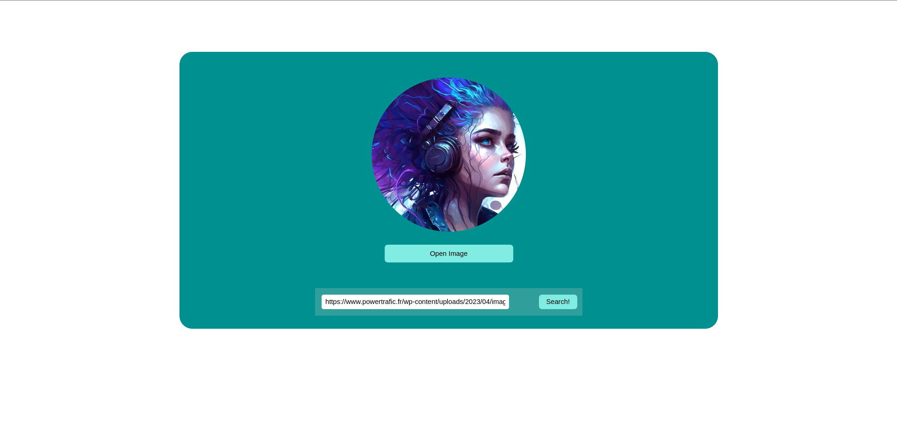

# Mirror-Image

### Believe or not, this is a very simple app just to introduce myself to the world of React-Typescript.

## UI

#### It has a very unique and simple design. By the way I design it by `SCSS`. You can see the Demo view image below:



## Logic

#### You just need to enter a valid url which conatins an image. the click the `Search!` button and it will show you the image that you have chosen.

#### After all, if you interest you can see the image in full screen mode by clicking the `Open Image` button.

## GO ON

#### I will be so glad if you decide to improve this project. You can fork repository and clone the project.

#### When you cloned the repository you just need to go to main folder and install the requirements:

```
    cd mirror-image
    npm install
```

#### Then just run the app:

```
    npm start
```
